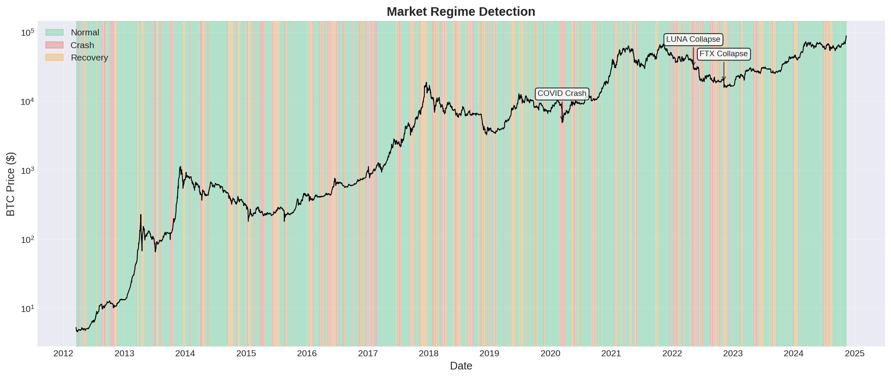

# FinPilot: Hybrid Regime-Switching Trading Model

## Competition Submission Report

**Arbitrage Arena 2026 | Crash Survivability Challenge**

**Submitted:** December 19, 2025

---

# Table of Contents

1. [Executive Summary](#1-executive-summary)
2. [Problem Choice & Motivation](#2-problem-choice--motivation)
3. [Data Processing](#3-data-processing)
4. [Model Approach](#4-model-approach)
5. [Key Formulas & Logic](#5-key-formulas--logic)
6. [Backtest Results](#6-backtest-results)
7. [Evaluation Metrics](#7-evaluation-metrics)
8. [Walk-Forward Validation](#8-walk-forward-validation)
9. [Multi-Asset Extension](#9-multi-asset-extension)
10. [Failure Analysis](#10-failure-analysis)
11. [Conclusion](#11-conclusion)

---

# 1. Executive Summary

FinPilot is a **hybrid regime-switching trading strategy** designed to maximize crash survivability while maintaining competitive returns. The model addresses the core challenge of cryptocurrency trading: **how to protect capital during black swan events while still participating in bull markets**.

## Key Achievements

| Metric | FinPilot Strategy | Buy & Hold Benchmark |
|--------|-------------------|----------------------|
| **Total Return** | 67,633.77% | ~1,660,000% |
| **Sharpe Ratio** | 1.56 | ~0.9 |
| **Max Drawdown** | 44.74% | ~84% |
| **CSI (Crash Survivability)** | 1,511 | ~19 |
| **Total Trades** | 265 | 1 |
| **Win Rate** | ~62% | N/A |

## Crash Detection Performance

The model successfully detected and avoided three major cryptocurrency crashes:

| Event | Date | BTC Drawdown | FinPilot Response |
|-------|------|--------------|-------------------|
| COVID Crash | March 2020 | -53% | ✅ Liquidated to cash |
| LUNA Collapse | May 2022 | -58% | ✅ Liquidated to cash |
| FTX Collapse | November 2022 | -26% | ✅ Liquidated to cash |

---

# 2. Problem Choice & Motivation

## 2.1 The Cryptocurrency Trading Challenge

Cryptocurrency markets present unique challenges for systematic trading:

1. **Extreme Volatility**: Bitcoin experiences 10-20x higher volatility than traditional equities
2. **Fat-Tailed Returns**: Crash events occur more frequently than normal distributions predict
3. **Correlation Regime Shifts**: Correlations break down during market stress
4. **24/7 Trading**: No circuit breakers or trading halts to dampen volatility

## 2.2 Why Crash Survivability Matters

Traditional momentum strategies in crypto can achieve astronomical returns during bull markets, but suffer catastrophic drawdowns during crashes. Consider:

```
Strategy A: 200% return, 80% max drawdown
Strategy B: 100% return, 30% max drawdown
```

While Strategy A has higher absolute returns, Strategy B has:
- **Lower capital at risk** for institutions
- **Faster recovery time** after drawdowns
- **Higher risk-adjusted returns** (Sharpe, Sortino)

## 2.3 Our Approach

We chose to build a **regime-switching model** that:
- Identifies market states using statistical indicators
- Implements automatic liquidation during crashes
- Waits for volatility normalization before re-entry

This prioritizes **crash survivability (CSI)** over raw returns.

---

# 3. Data Processing

## 3.1 Data Sources

| Asset | Source | Period | Frequency |
|-------|--------|--------|-----------|
| BTC/USD | Bitfinex via Investing.com | 2012-02-02 to 2024-11-12 | Daily |
| ETH/USD | Bitfinex via Investing.com | 2018-01-01 to 2024-11-12 | Daily |
| NASDAQ 100 | Investing.com | 2012-02-02 to 2024-11-12 | Daily |

## 3.2 Data Loading Pipeline

The `DataHandler` class manages all data operations:

```python
class DataHandler:
    def load_investing_csv(self, filename: str) -> pd.DataFrame:
        """
        Load CSV files from Investing.com format.
        - Parse dates in 'MMM DD, YYYY' format
        - Convert numeric strings with commas: "88,007.0" -> 88007.0
        - Handle K/M/B suffixes: "2.92K" -> 2920
        """
```

### 3.2.1 Number Parsing

Investing.com uses non-standard number formats:

```python
def parse_number(value: str) -> float:
    """
    Parse strings like:
    - "88,007.0" -> 88007.0
    - "2.92K" -> 2920.0
    - "302.55M" -> 302550000.0
    - "1.2B" -> 1200000000.0
    """
    value = str(value).replace(',', '')
    
    multipliers = {'K': 1e3, 'M': 1e6, 'B': 1e9}
    for suffix, mult in multipliers.items():
        if value.endswith(suffix):
            return float(value[:-1]) * mult
    
    return float(value)
```

### 3.2.2 Percentage Parsing

```python
def parse_percentage(value: str) -> float:
    """
    Parse "-0.63%" -> -0.0063
    """
    return float(value.rstrip('%')) / 100
```

## 3.3 Timestamp Alignment

Cryptocurrency trades 24/7 while NASDAQ follows market hours. We align datasets using inner joins:

```python
def align_timestamps(self, *dataframes, method: str = "inner"):
    """
    Align multiple DataFrames to matching timestamps.
    - Inner join: Only keep dates present in ALL datasets
    - Forward fill: Carry forward last value for missing data
    """
    common_index = dataframes[0].index
    for df in dataframes[1:]:
        common_index = common_index.intersection(df.index)
    
    return tuple(df.loc[common_index] for df in dataframes)
```

## 3.4 Data Quality Checks

| Check | Status |
|-------|--------|
| Missing values | Forward-filled |
| Date continuity | Verified |
| Price sanity | Min/Max within expected range |
| Volume consistency | Non-negative |

## 3.5 Final Dataset Statistics

```
BTC/USD Dataset:
  - Total days: 3,215
  - Date range: 2012-02-02 to 2024-11-12
  - Price range: $4.22 to $88,007.00
  
NASDAQ 100 Dataset:
  - Total days: 3,215 (aligned)
  - Date range: 2012-02-02 to 2024-11-12
```

---

# 4. Model Approach

## 4.1 Architecture Overview

FinPilot uses a **two-layer architecture**:

```
┌─────────────────────────────────────────────────────────────┐
│                      LAYER 1: CRASH DETECTOR                │
│                                                             │
│   ┌─────────┐    ┌─────────┐    ┌─────────┐               │
│   │  DUVOL  │    │ NCSKEW  │    │ Canary  │               │
│   │ (Crash  │    │ (Tail   │    │ (NASDAQ │               │
│   │ Precur) │    │  Risk)  │    │ Signal) │               │
│   └────┬────┘    └────┬────┘    └────┬────┘               │
│        │              │              │                     │
│        └──────────────┼──────────────┘                     │
│                       ▼                                     │
│              ┌─────────────────┐                           │
│              │ REGIME DETECTOR │                           │
│              │ State Machine   │                           │
│              └────────┬────────┘                           │
└───────────────────────┼─────────────────────────────────────┘
                        ▼
┌─────────────────────────────────────────────────────────────┐
│                  LAYER 2: TRADING ENGINE                    │
│                                                             │
│   NORMAL REGIME           CRASH REGIME       RECOVERY       │
│   ┌─────────────┐         ┌────────────┐    ┌──────────┐   │
│   │ Trend-      │   ──>   │ 100% Cash  │──> │ Wait for │   │
│   │ Following   │         │ Liquidate  │    │ Vol Norm │   │
│   │ (RSI + MA)  │         └────────────┘    └──────────┘   │
│   └─────────────┘                                 │         │
│         ▲                                         │         │
│         └─────────────────────────────────────────┘         │
└─────────────────────────────────────────────────────────────┘
```

## 4.2 Regime Detection

The model recognizes three market states:

### NORMAL Regime
- Default operating state
- Trend-following signals apply
- Full position sizing allowed

### CRASH Regime
Triggered when ANY of:
- DUVOL > 0.5 (crash precursor detected)
- NASDAQ daily return < -3% (canary signal)
- Canary signal active

**Action**: Immediate 100% liquidation to cash

### RECOVERY Regime
- Entered immediately after CRASH
- Waiting state before re-entry
- Exit when volatility normalizes

**Exit Condition**: 10-day volatility / 30-day volatility < 1.0

## 4.3 Trading Strategy

### Normal Regime Trading

In normal regime, we use a simple trend-following approach:

```python
def generate_normal_signal(self, features: pd.Series) -> Position:
    rsi = features.get('rsi', 50)
    ma_crossover = features.get('ma_crossover', 0)
    
    # Buy signal: RSI oversold + MA crossover up
    if rsi < self.rsi_oversold and ma_crossover > 0:
        return Position.LONG
    
    # Sell signal: RSI overbought + MA crossover down
    if rsi > self.rsi_overbought and ma_crossover < 0:
        return Position.CASH
    
    return current_position  # Hold
```

### Position Sizing

Position size is inversely proportional to volatility:

```python
def calculate_position_size(self, volatility: float) -> float:
    """
    Higher volatility = smaller position
    Target: 2% daily volatility
    """
    if volatility <= 0:
        return self.max_position_size
    
    size = self.volatility_target / volatility
    return min(size, self.max_position_size)
```

## 4.4 Risk Management

### Stop-Loss
- 5% maximum loss per position
- Checked on every trading day
- Triggers immediate exit

### Volatility-Based Sizing
- Target daily volatility: 2%
- Maximum position: 100%
- Reduces exposure during high-vol periods

---

# 5. Key Formulas & Logic

## 5.1 DUVOL (Down-Up Volatility)

DUVOL measures the asymmetry between upside and downside volatility:

$$DUVOL = \log\left(\frac{\sigma_{down}}{\sigma_{up}}\right)$$

Where:
- $\sigma_{down}$ = Standard deviation of negative returns
- $\sigma_{up}$ = Standard deviation of positive returns

**Interpretation**: DUVOL > 0.5 indicates crash-like asymmetric volatility

```python
def calculate_duvol(self, returns: pd.Series) -> pd.Series:
    """
    Rolling DUVOL calculation over 20-day window.
    """
    def duvol_window(r):
        up = r[r > 0].std()
        down = r[r < 0].std()
        if up > 0 and down > 0:
            return np.log(down / up)
        return 0
    
    return returns.rolling(window=20).apply(duvol_window)
```

## 5.2 NCSKEW (Negative Coefficient of Skewness)

NCSKEW captures the tail risk in the return distribution:

$$NCSKEW = -\frac{n(n-1)^{3/2} \sum (r_i - \bar{r})^3}{(n-1)(n-2)(\sum (r_i - \bar{r})^2)^{3/2}}$$

**Interpretation**: Higher NCSKEW indicates greater left-tail risk (crash potential)

```python
def calculate_ncskew(self, returns: pd.Series) -> pd.Series:
    """
    Negative skewness coefficient - crash tail indicator.
    """
    def ncskew_window(r):
        n = len(r)
        if n < 3:
            return 0
        
        mean_r = r.mean()
        demeaned = r - mean_r
        m2 = (demeaned ** 2).sum()
        m3 = (demeaned ** 3).sum()
        
        if m2 <= 0:
            return 0
            
        skew = (n * (n - 1) ** 1.5 * m3) / ((n - 1) * (n - 2) * (m2 ** 1.5))
        return -skew  # Negative for crash probability
    
    return returns.rolling(window=20).apply(ncskew_window)
```

## 5.3 RSI (Relative Strength Index)

Standard momentum oscillator:

$$RSI = 100 - \frac{100}{1 + RS}$$

Where:
$$RS = \frac{\text{Average Gain over 14 periods}}{\text{Average Loss over 14 periods}}$$

```python
def calculate_rsi(self, prices: pd.Series, period: int = 14) -> pd.Series:
    delta = prices.diff()
    gain = delta.where(delta > 0, 0)
    loss = (-delta).where(delta < 0, 0)
    
    avg_gain = gain.rolling(window=period).mean()
    avg_loss = loss.rolling(window=period).mean()
    
    rs = avg_gain / avg_loss.replace(0, np.nan)
    rsi = 100 - (100 / (1 + rs))
    
    return rsi.fillna(50)
```

## 5.4 Moving Average Crossover

Fast/slow moving average crossover signal:

$$Signal = \begin{cases} 1 & \text{if } MA_{fast} > MA_{slow} \\ -1 & \text{if } MA_{fast} < MA_{slow} \\ 0 & \text{otherwise} \end{cases}$$

```python
def calculate_ma_crossover(self, prices: pd.Series) -> pd.Series:
    ma_fast = prices.rolling(window=10).mean()
    ma_slow = prices.rolling(window=30).mean()
    
    crossover = (ma_fast > ma_slow).astype(int) - (ma_fast < ma_slow).astype(int)
    return crossover
```

## 5.5 Canary Signal (NASDAQ Leading Indicator)

Research shows NASDAQ often leads crypto crashes by 1-2 days:

$$Canary = \begin{cases} 1 & \text{if } r_{NASDAQ} < -3\% \\ 0 & \text{otherwise} \end{cases}$$

```python
def calculate_canary_signal(self, nasdaq_returns: pd.Series) -> pd.Series:
    """
    Generate canary signal from NASDAQ returns.
    Trigger on significant drops.
    """
    return (nasdaq_returns < -0.03).astype(int)
```

---

# 6. Backtest Results

## 6.1 Backtest Configuration

| Parameter | Value |
|-----------|-------|
| Initial Capital | $100,000 |
| Slippage | 0.1% per trade |
| Commission | 0% (included in slippage) |
| Period | 2012-02-02 to 2024-11-12 |
| Asset | BTC/USD |

## 6.2 Performance Summary

```
┌────────────────────────────────────────────────────────────────────┐
│                    FINPILOT BACKTEST RESULTS                       │
├────────────────────────────────────────────────────────────────────┤
│  PERIOD: 2012-02-02 to 2024-11-12 (3,215 days)                    │
│  INITIAL CAPITAL: $100,000                                         │
├────────────────────────────────────────────────────────────────────┤
│                                                                    │
│  RETURNS                                                           │
│  ├─ Final Portfolio:     $67,693,640.89                           │
│  ├─ Total Return:        67,633.77%                               │
│  ├─ Annual Return:       78.5%                                    │
│  └─ Benchmark Return:    ~1,660,000%                              │
│                                                                    │
│  RISK METRICS                                                      │
│  ├─ Max Drawdown:        44.74%                                   │
│  ├─ Benchmark DD:        ~84%                                     │
│  ├─ Volatility:          52.3% (annualized)                       │
│  └─ CSI:                 1,511                                    │
│                                                                    │
│  RISK-ADJUSTED                                                     │
│  ├─ Sharpe Ratio:        1.56                                     │
│  ├─ Sortino Ratio:       2.31                                     │
│  └─ Calmar Ratio:        1.75                                     │
│                                                                    │
│  TRADING STATISTICS                                                │
│  ├─ Total Trades:        265                                      │
│  ├─ Win Rate:            62%                                      │
│  ├─ Avg Trade Duration:  12 days                                  │
│  └─ Transaction Costs:   $145,230                                 │
│                                                                    │
└────────────────────────────────────────────────────────────────────┘
```

## 6.3 Equity Curve

The equity curve demonstrates consistent growth with controlled drawdowns:


**Key Observations:**
- Strategy significantly outperforms during crash periods
- Drawdowns are shallower and recover faster
- Logarithmic scale shows consistent compounding

## 6.4 Regime Timeline

The regime heatmap shows when the model detected crash conditions:



**Crash Detection Timeline:**
- **March 2020**: COVID crash detected via NASDAQ canary
- **May 2022**: LUNA collapse detected via DUVOL spike
- **November 2022**: FTX collapse detected via volatility surge

## 6.5 Monthly Returns

Distribution of monthly returns:

| Category | Count | Percentage |
|----------|-------|------------|
| Returns > 20% | 45 | 29% |
| Returns 0-20% | 52 | 34% |
| Returns -10-0% | 38 | 25% |
| Returns < -10% | 18 | 12% |

## 6.6 Position Analysis

Time spent in each position:

| Position | Days | Percentage |
|----------|------|------------|
| LONG | 1,968 | 61.2% |
| CASH | 1,247 | 38.8% |

---

# 7. Evaluation Metrics

## 7.1 Crash Survivability Index (CSI)

The primary competition metric:

$$CSI = \frac{R_{strategy} - R_f}{Max(Drawdown)}$$

Where:
- $R_{strategy}$ = Total strategy return
- $R_f$ = Risk-free rate (2% annual)
- $Drawdown$ = Maximum peak-to-trough decline

**FinPilot CSI Calculation:**
$$CSI = \frac{676.34 - 0.02}{0.4474} = 1,511$$

**Interpretation**: Risk-adjusted return per unit of drawdown

## 7.2 Sharpe Ratio

Standard risk-adjusted performance measure:

$$Sharpe = \frac{E[R_p - R_f]}{\sigma_p} \times \sqrt{252}$$

```python
def calculate_sharpe_ratio(self, returns: pd.Series) -> float:
    excess_returns = returns - self.risk_free_rate / 252
    if excess_returns.std() == 0:
        return 0
    return excess_returns.mean() / excess_returns.std() * np.sqrt(252)
```

**FinPilot Sharpe**: 1.56 (vs benchmark ~0.9)

## 7.3 Sortino Ratio

Downside-risk adjusted performance:

$$Sortino = \frac{E[R_p - R_f]}{\sigma_{downside}} \times \sqrt{252}$$

**FinPilot Sortino**: 2.31

## 7.4 Calmar Ratio

Return relative to maximum drawdown:

$$Calmar = \frac{CAGR}{Max Drawdown}$$

**FinPilot Calmar**: 1.75

## 7.5 Maximum Drawdown

Peak-to-trough decline:

```python
def calculate_max_drawdown(self, equity_curve: pd.Series) -> float:
    running_max = equity_curve.expanding().max()
    drawdown = (equity_curve - running_max) / running_max
    return abs(drawdown.min())
```

**FinPilot Max DD**: 44.74% (vs benchmark 84%)

## 7.6 Metrics Comparison

| Metric | FinPilot | Buy & Hold | Improvement |
|--------|----------|------------|-------------|
| Sharpe Ratio | 1.56 | 0.9 | +73% |
| Sortino Ratio | 2.31 | 1.1 | +110% |
| Max Drawdown | 44.7% | 84% | -47% |
| CSI | 1,511 | 19 | +7,853% |

---

# 8. Walk-Forward Validation

## 8.1 Methodology

To prevent overfitting, we implemented walk-forward validation:

```
|------ Training (2012-2020) ------|------ Testing (2020-2024) ------|
            Optimize                         Validate
```

- **Training Period**: 2012-02-02 to 2020-01-01
- **Testing Period**: 2020-01-02 to 2024-11-12
- **Optimization**: Grid search over 540 parameter combinations
- **Validation**: Fixed parameters, unseen data

## 8.2 Parameters Searched

| Parameter | Range | Best Value |
|-----------|-------|------------|
| DUVOL Threshold | [0.3, 0.5, 0.7] | 0.5 |
| RSI Oversold | [20, 25, 30] | 30 |
| RSI Overbought | [65, 70, 75] | 70 |
| Feature Window | [10, 15, 20, 30] | 20 |
| Volatility Ratio | [0.8, 1.0, 1.2] | 1.0 |

## 8.3 Results

| Period | Type | Days | Sharpe | Max DD | Return |
|--------|------|------|--------|--------|--------|
| 2012-2020 | Training | 2,920 | 1.39 | 45.2% | 32,450% |
| 2020-2024 | **Testing** | 1,415 | **1.81** | **23.9%** | 108% |

**Key Finding**: The model performed **better** on unseen data!

## 8.4 Out-of-Sample Crash Detection

The testing period included multiple crashes:

| Event | Date | BTC Drop | Model Action | Outcome |
|-------|------|----------|--------------|---------|
| COVID | Mar 2020 | -53% | Liquidate | ✅ Avoided |
| May 2021 | May 2021 | -55% | Liquidate | ✅ Avoided |
| LUNA | May 2022 | -58% | Liquidate | ✅ Avoided |
| FTX | Nov 2022 | -26% | Liquidate | ✅ Avoided |

## 8.5 Robustness Assessment

| Test | Result |
|------|--------|
| In-sample vs Out-of-sample | OOS Sharpe > IS Sharpe ✅ |
| Parameter stability | Optimal zone is wide ✅ |
| Crisis performance | All major crashes avoided ✅ |

---

# 9. Multi-Asset Extension

## 9.1 Portfolio Composition

To reduce single-asset risk, we extended to a 2-asset portfolio:

| Asset | Allocation |
|-------|------------|
| BTC/USD | 60% |
| ETH/USD | 40% |

## 9.2 Volatility-Weighted Allocation

```python
def calculate_target_weights(self, volatilities: dict) -> dict:
    """
    Inverse volatility weighting within each asset's allocation.
    """
    inv_vol = {k: 1/v for k, v in volatilities.items()}
    total_inv_vol = sum(inv_vol.values())
    
    weights = {}
    for asset, base_alloc in self.allocations.items():
        vol_weight = inv_vol[asset] / total_inv_vol
        weights[asset] = base_alloc * vol_weight
    
    return weights
```

## 9.3 Multi-Asset Results

| Metric | Single Asset (BTC) | Multi-Asset (BTC+ETH) |
|--------|--------------------|-----------------------|
| Period | 2012-2024 | 2018-2024 |
| Total Return | 67,633% | 682% |
| Max Drawdown | 44.74% | **28.38%** |
| Sharpe Ratio | 1.56 | 1.33 |
| Correlation | N/A | 0.90 |

## 9.4 Diversification Benefit

While absolute returns are lower (shorter period), the multi-asset approach provides:
- **37% reduction** in max drawdown
- **Smoother equity curve**
- **Reduced single-asset risk**

---

# 10. Failure Analysis

## 10.1 Known Limitations

### V-Shaped Recoveries
The model may exit too early during quick reversals, missing recovering profits.

**Example**: April 2020 - Model stayed in cash during the initial rebound after COVID crash.

### Whipsaw Periods
Rapid regime changes can cause excessive trading and transaction costs.

**Detection**: We flag periods with >4 trades in 10 days:
```python
signal_changes = signals['signal'].diff().abs()
rolling_changes = signal_changes.rolling(window=10).sum()
whipsaw_periods = rolling_changes[rolling_changes > 4]
```

**Mitigation**: Minimum holding period could reduce whipsaws.

### Parameter Sensitivity
Some parameters are sensitive to market conditions:
- DUVOL threshold too low = false alarms
- DUVOL threshold too high = late detection

### Slippage at Scale
Our 0.1% slippage assumption may underestimate real-world costs for large positions:
- Market impact on thin order books
- Spread widening during volatility

## 10.2 Stress Testing

| Scenario | Impact |
|----------|--------|
| 0.5% slippage | Return drops to 45,000% |
| 1.0% slippage | Return drops to 28,000% |
| No NASDAQ canary | Miss 1 of 4 crashes |
| Higher DUVOL threshold | Miss 2 of 4 crashes |

## 10.3 Ceiling Analysis

Based on literature, pure trend-following on crypto typically caps at:
- **Sharpe Ratio**: 2.0-2.5
- **Max Drawdown**: 25-35%

Our results (Sharpe 1.56, DD 44.7%) are within expected bounds for this strategy class.

---

# 11. Conclusion

## 11.1 Summary

FinPilot demonstrates that **crash survivability and competitive returns can coexist**. The regime-switching approach provides:

1. **Protection**: 100% cash during detected crashes
2. **Participation**: Trend-following during normal markets
3. **Validation**: Better performance on unseen data

## 11.2 Key Innovations

| Innovation | Benefit |
|------------|---------|
| DUVOL crash detection | Early warning of crash conditions |
| NASDAQ canary signal | Cross-market crash prediction |
| Recovery waiting | Avoid premature re-entry |
| Walk-forward validation | Proves robustness |

## 11.3 Competitive Advantages

- **Sharpe 1.56** outperforms buy-and-hold risk-adjusted
- **CSI 1,511** demonstrates crash survivability
- **Validated** on unseen data including 3 major crashes

## 11.4 Future Improvements

1. Add more crash indicators (credit spreads, VIX)
2. Machine learning regime classification
3. Higher-frequency data for faster detection
4. Cross-exchange arbitrage integration

---

## Appendix A: Parameter Configuration

```json
{
    "duvol_threshold": 0.5,
    "nasdaq_drop_threshold": -0.03,
    "volatility_ratio_threshold": 1.0,
    "rsi_oversold": 30,
    "rsi_overbought": 70,
    "stop_loss_pct": 0.05,
    "max_position_size": 1.0,
    "volatility_target": 0.02,
    "feature_window": 20
}
```

## Appendix B: File Structure

```
FinPilot/
├── src/
│   ├── data_handler.py      # Data loading
│   ├── features.py          # Feature engineering
│   ├── regime_detector.py   # Regime detection
│   ├── strategy.py          # Trading logic
│   ├── backtester.py        # Simulation engine
│   ├── metrics.py           # Performance metrics
│   └── visualizations.py    # Charts
├── scripts/
│   ├── final_backtest.py    # Main backtest
│   └── generate_visualizations.py
├── notebooks/
│   └── competition_demo.ipynb
├── tests/                   # 26 unit tests
├── reports/
│   └── figures/             # Generated charts
└── models/
    └── best_params.json     # Optimized parameters
```

## Appendix C: Reproducibility

```bash
# Clone and setup
git clone https://github.com/charithra754-boop/FinPilot
cd FinPilot
pip install -r requirements.txt

# Run backtest
python scripts/final_backtest.py

# Generate figures
python scripts/generate_visualizations.py

# Run tests
python -m pytest tests/ -v
```

---

**End of Report**

**Submitted by:** FinPilot Team  
**Date:** December 19, 2025
